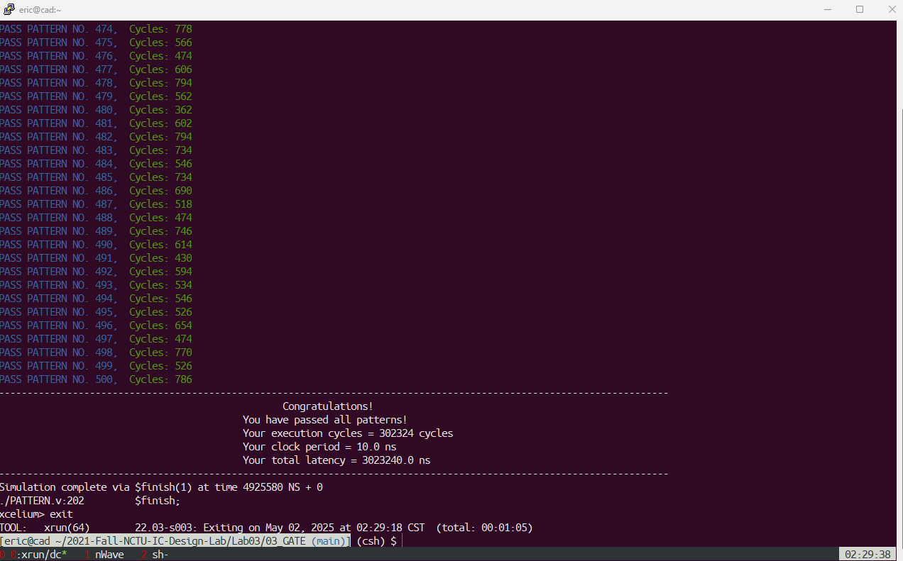

# 17x17 MAZE Solving
* Start: (0, 0) -> Target: (16, 16)
* Given a 17x17 maze, return the directions along the path from start to target cell
* Note:
  * Instead of pure `for` loops, using `generate` blocks helps reducing some area, and improve time slack from 0.00 to 0.03!
  * If the design contains more than one modules, the given syn.tcl can't be used as it's for single-module designs
    * For Multiple-module designs, syn.tcl should use
      ```
      analyze -f verilog $my_verilog_files
      elaborate $my_toplevel
      current_design $my_toplevel
      link
      ```
  
## Components
* FIFO Memory (Queue)
* 2-d Memory for saving the maze (0 for wall, 1 for path)
* 2-d Memory for saving the parent direction of each cell
* 1-d Memory for saving the directions from the target to the start cell

## Method
### Test Patterns Generation
* [PATTERN.cpp](00_TESTBED/PATTERN.cpp):
  * Maze Generation: Backtracking (DFS)
    1. Generate mazes of walls
    2. Start from `(0,0)`, randomly break the walls around the current cell
    3. Repeat the process 'till `(16,16)` reached
  * Maze Solving:
    1. BFS from `(0,0)` to `(16,16)` and store the direction from next cells to its parent cell
    2. Backtrack to `(0,0)` according to the stored directions

  
## Gate-level Result



* Timing Report
```
****************************************
Report : timing
        -path full
        -delay max
        -max_paths 1
Design : MAZE
Version: S-2021.06-SP2
Date   : Fri May  2 22:37:18 2025
****************************************

Operating Conditions: slow   Library: slow
Wire Load Model Mode: top

  Startpoint: curr_x_reg[1]
              (rising edge-triggered flip-flop clocked by clk)
  Endpoint: Q/mem_reg[3][0]
            (rising edge-triggered flip-flop clocked by clk)
  Path Group: clk
  Path Type: max

  Point                                    Incr       Path
  -----------------------------------------------------------
  clock clk (rise edge)                   10.00      10.00
  clock network delay (ideal)              0.00      10.00
  Q/mem_reg[3][0]/CK (DFFSX1)              0.00      10.00 r
  library setup time                      -0.13       9.87
  data required time                                  9.87
  -----------------------------------------------------------
  data required time                                  9.87
  data arrival time                                  -9.83
  -----------------------------------------------------------
  slack (MET)                                         0.03
```

* Area Report
```
****************************************
Report : area
Design : MAZE
Version: S-2021.06-SP2
Date   : Fri May  2 22:37:18 2025
****************************************

Library(s) Used:

    slow (File: /home/eric/CBDK018_TSMC_Artisan/CIC/SynopsysDC/slow.db)

Number of ports:                            7
Number of nets:                          6752
Number of cells:                         5844
Number of combinational cells:           4192
Number of sequential cells:              1652
Number of macros/black boxes:               0
Number of buf/inv:                        236
Number of references:                      58

Combinational area:              61864.387571
Buf/Inv area:                     1613.304021
Noncombinational area:          104409.041748
Macro/Black Box area:                0.000000
Net Interconnect area:      undefined  (No wire load specified)

Total cell area:                166273.429319
Total area:                 undefined
```
