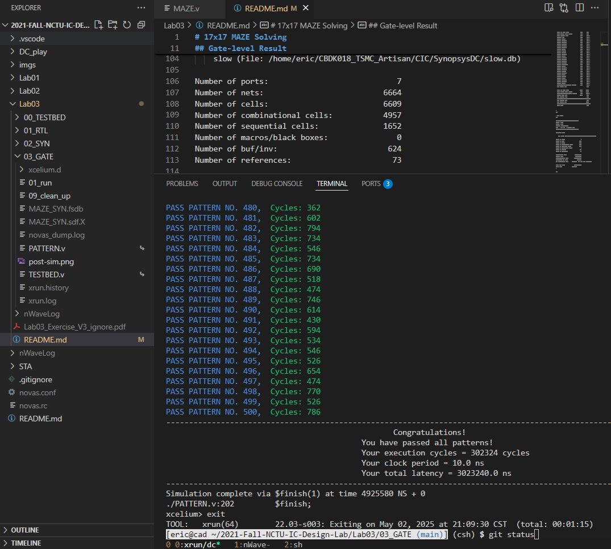

# 17x17 MAZE Solving
* Start: (0, 0) -> Target: (16, 16)
* Given a 17x17 maze, return the directions along the path from start to target cell
  
## Components
* FIFO Memory (Queue)
* 2-d Memory for saving the maze (0 for wall, 1 for path)
* 2-d Memory for saving the parent direction of each cell
* 1-d Memory for saving the directions from the target to the start cell
  
## Gate-level Result



* Timing Report
```
Information: Updating design information... (UID-85)
Warning: Design 'MAZE' contains 2 high-fanout nets. A fanout number of 1000 will be used for delay calculations involving these nets. (TIM-134)
 
****************************************
Report : timing
        -path full
        -delay max
        -max_paths 1
Design : MAZE
Version: S-2021.06-SP2
Date   : Fri May  2 21:07:34 2025
****************************************

 # A fanout number of 1000 was used for high fanout net computations.

Operating Conditions: slow   Library: slow
Wire Load Model Mode: top

  Startpoint: in_valid (input port clocked by clk)
  Endpoint: prev_dirs_reg[4][14][0]
            (rising edge-triggered flip-flop clocked by clk)
  Path Group: clk
  Path Type: max

  Point                                    Incr       Path
  -----------------------------------------------------------
  clock clk (rise edge)                    0.00       0.00
  clock network delay (ideal)              0.00       0.00
  input external delay                     5.00       5.00 f
  in_valid (in)                            0.00       5.00 f
  U5571/Y (INVX8)                          0.05       5.05 r
  U5572/Y (NAND2X4)                        0.05       5.10 f
  U5574/Y (NAND3X4)                        0.12       5.22 r
  U5575/Y (NAND2X4)                        0.11       5.33 f
  U5154/Y (OAI22X2)                        0.18       5.52 r
  U5225/Y (AOI22X1)                        0.12       5.63 f
  U5585/Y (INVX1)                          0.13       5.76 r
  U4603/Y (XOR2X2)                         0.34       6.10 f
  U4400/Y (NOR2X2)                         0.34       6.43 r
  U5180/Y (NAND2X1)                        0.16       6.59 f
  U4381/Y (INVX1)                          0.51       7.10 r
  U5945/Y (NAND2XL)                        0.11       7.21 f
  U5946/Y (OAI21XL)                        0.12       7.33 r
  U5947/Y (AOI21XL)                        0.08       7.40 f
  U5951/Y (NAND4XL)                        0.13       7.53 r
  U4429/Y (AOI2BB1XL)                      0.22       7.75 r
  U5957/Y (OR4X2)                          0.20       7.95 r
  U6007/Y (NAND3X1)                        0.08       8.04 f
  U6008/Y (OAI22X1)                        0.21       8.25 r
  U6009/Y (AND3X4)                         0.22       8.47 r
  U6390/Y (NAND2X4)                        0.08       8.55 f
  U7402/Y (OR2X4)                          0.24       8.79 f
  U4368/Y (NOR2X1)                         0.12       8.91 r
  U4364/Y (BUFX3)                          0.27       9.18 r
  U5276/Y (NAND2XL)                        0.12       9.30 f
  U4979/Y (NAND2X1)                        0.19       9.48 r
  U8854/Y (MX2X1)                          0.25       9.73 f
  prev_dirs_reg[4][14][0]/D (DFFSX1)       0.00       9.73 f
  data arrival time                                   9.73

  clock clk (rise edge)                   10.00      10.00
  clock network delay (ideal)              0.00      10.00
  prev_dirs_reg[4][14][0]/CK (DFFSX1)      0.00      10.00 r
  library setup time                      -0.27       9.73
  data required time                                  9.73
  -----------------------------------------------------------
  data required time                                  9.73
  data arrival time                                  -9.73
  -----------------------------------------------------------
  slack (MET)                                         0.00


1
```

* Area Report
```
 
****************************************
Report : area
Design : MAZE
Version: S-2021.06-SP2
Date   : Fri May  2 21:07:34 2025
****************************************

Library(s) Used:

    slow (File: /home/eric/CBDK018_TSMC_Artisan/CIC/SynopsysDC/slow.db)

Number of ports:                            7
Number of nets:                          6664
Number of cells:                         6609
Number of combinational cells:           4957
Number of sequential cells:              1652
Number of macros/black boxes:               0
Number of buf/inv:                        624
Number of references:                      73

Combinational area:              76756.680584
Buf/Inv area:                     4523.904063
Noncombinational area:          104409.041748
Macro/Black Box area:                0.000000
Net Interconnect area:      undefined  (No wire load specified)

Total cell area:                181165.722332
Total area:                 undefined
1

```