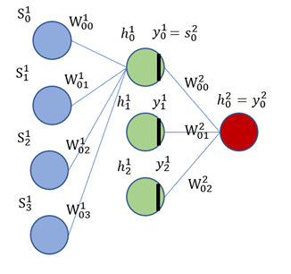

# Lab04: Training ANNs

* [ANN Structure](#ann-structure)
* [Stage Breakdown](#stage-breakdown)
   1. [Forward Pass](#forward)
   2. [Backward Pass](#backward)
   3. [Weights Update](#update)
 * [DesignWare](#designware)
      
## ANN Structure



* Activation Function: $ReLU(x)=x,\ if (x>0),\ otherwise\ 0.$ 
  * Only applied in the hidden layer

* Hidden layer weights $W^1$
  * { $w^1_0$, $w^1_1$, $w^1_2$, $w^1_3$ }: For calculating $h^1_0$
  * { $w^1_4$, $w^1_5$, $w^1_6$, $w^1_7$ }: For calculating $h^1_1$
  * { $w^1_8$, $w^1_9$, $w^1_{10}$, $w^1_{11}$ }: For calculating $h^1_2$

* Output layer weights $W^2$
  * { $w^2_0$, $w^2_1$, $w^2_2$ }: For calculating $h^2_0$ (Final output)

* Loss b/w prediction and target
  * $\delta^2_0$: Output layer error, aka, loss
  * Loss Function: $L(y_{pred})=y_{pred}-y_{gold}$

* Cycle Time $T_{cycle}$: Regardless of P&R, approximately equals to the delay of a `DW_fp_mac`

## Stage Breakdown


* Input data $S = [s_0,s_1,s_2,s_3]_{1\times4}$

* Hidden layer weights $W^1, where$

```math
W^1 = 
\begin{bmatrix}
w^1_0 & w^1_4 & w^1_8    \\
w^1_1 & w^1_5 & w^1_9    \\
w^1_2 & w^1_6 & w^1_{10} \\
w^1_3 & w^1_7 & w^1_{11}
\end{bmatrix}_{4\times3}
```

### Forward

#### Hidden Layer Output (Hidden Layer Input)

* Using three Multiply-and-Adders (`DW_fp_mac`, `MAC1` to `MAC3`), $S*W^1$ can be done in 4 cycles ($C_1\ to\ C_4$)

```math
 S*W^1 = 
\begin{bmatrix}
        s_0*w^1_0 + s_1*w^1_1 \ + s_2*w^1_2 + s_3*w^1_3   \\  
        s_0*w^1_4 + s_1*w^1_5 \ + s_2*w^1_6 + s_3*w^1_7   \\
\ \ \ \ s_0*w^1_8   \ + s_1*w^1_9 + s_2*w^1_{10} + s_3*w^1_{11}  \end{bmatrix}^T_{3\times4} = 
    \begin{bmatrix} 
    h^1_0 \\
    h^1_1 \\ 
    h^1_2 \\
    \end{bmatrix}^T_{3\times1} = 
        \begin{bmatrix} 
        h^1_0 & h^1_1 & h^1_2
        \end{bmatrix}_{1\times3},\ where 
```

```math
\begin{array}{c}
h^1_0 = s_0*w^1_0 + s_1*w^1_1 \ + s_2*w^1_2 + s_3*w^1_3 \\
    h^1_1 = s_0*w^1_4 + s_1*w^1_5 \ + s_2*w^1_6 + s_3*w^1_7 \\
\ \ h^1_2 = s_0*w^1_8 + s_1*w^1_9 \ + s_2*w^1_{10} + s_3*w^1_{11} 
\end{array}
```

#### Activation function

* With a comparator `DW_fp_cmp` (`CMP1`), done at $C_4$
* $y^1_i=(h^1_i>0)\ ?\ h^1_i\ :\ 0$

```math
\begin{array}{c}
        y^1_0 = ReLU(h^1_0) = ReLU(s_0*w^1_0 + s_1*w^1_1 \ + s_2*w^1_2 + s_3*w^1_3) \\
        y^1_1 = ReLU(h^1_1) = ReLU(s_0*w^1_4 + s_1*w^1_5 \ + s_2*w^1_6 + s_3*w^1_7)  \\
\ \ \ \ y^1_2 = ReLU(h^1_2) = ReLU(s_0*w^1_8 + s_1*w^1_9 \ + s_2*w^1_{10} + s_3*w^1_{11})
\end{array}
```

#### Output Layer

* For less cycles, using three `DW_fp_mult` (`MULT1` to `MULT3`), one `DW_fp_sum3` (`SUM1`), and a `DW_fp_sub` (`SUB1`), $\{h^2_0, y^2_0\}$  takes just 1 cycle ($C_5$)
* For less area (not using `DW_fp_sum3`), re-using the original three MACs (`MAC1` to `MAC3`) can have it done with 3 cycles ($C_5\ to\ C_7$)

```math 
y^2_0 = (y^1_0*w^2_{0} + y^1_1*w^2_{1} + y^1_2*w^2_{2}) = h^2_0 
```

```math
\begin{array}{c}
y^2_0 = ReLU(s_0*w^1_{0} + s_1*w^1_{1} + s_2*w^1_{2}  + s_3*w^1_{3})  * w^2_{0} +  \\
\ \ \ \ \ \ \ \ \ ReLU(s_0*w^1_{4} + s_1*w^1_{5} + s_2*w^1_{6}  + s_3*w^1_{7})  * w^2_{1} +  \\
\ \ \ \ \ \ \ \ ReLU(s_0*w^1_{8} + s_1*w^1_{9} + s_2*w^1_{10} + s_3*w^1_{11}) * w^2_{2} 
\end{array}
```

### Backward

* $C^{curr/next}_i$: The i-th cycle of current/next iteration

* Output Layer Loss
  * $y^2_0 - t_0 $: `DW_fp_sub` (`SUB1`) at $C^{curr}_5$ 

$$  \delta^2_0 = y^2_0 - t_0 $$

* Hidden Layer Loss
  * $\delta^1_i=(h^1_i>0)\ ? \ (w^2_{i}*\delta^2_i)\ :\ 0,\ where\ i\in\{0,1,2\}$
    * $(w^2_{i}*\delta^2_i)$: `CMP1`, `MULTi`, at $C^{curr}_6$

```math
\begin{array}{c}
    \delta^{1}_0 = ReLU(h^1_0)' * w^2_{0} * \delta^2_0 \\
    \delta^{1}_1 = ReLU(h^1_1)' * w^2_{1} * \delta^2_0 \\
    \delta^{1}_2 = ReLU(h^1_2)' * w^2_{2} * \delta^2_0 
\end{array}
```

### Update

#### Output Layer

* $w^2_{i} = w^2_{i} - LR * \delta^2_0 * y^1_i$
  * $(LR * \delta^2_0)$: `MUL4` at $C^{curr}_6$
  * $w^2_{i} - (LR * \delta^2_0)*y^1_i$: `MULi`, `SUBi` at $C^{next}_4$ 

```math
\begin{array}{c}
    w^2_{0} = w^2_{0} - LR * \delta^2_0 * y^1_0 \\
    w^2_{1} = w^2_{1} - LR * \delta^2_0 * y^1_1 \\
    w^2_{2} = w^2_{2} - LR * \delta^2_0 * y^1_2  
\end{array}
```

#### Hidden Layer

##### For $h^1_0$ in next iteration

```math
\begin{array}{c}
    w^1_{0} = w^1_{0} - (LR * s_0) * \delta^1_0 \\
    w^1_{1} = w^1_{1} - (LR * s_1) * \delta^1_0 \\
    w^1_{2} = w^1_{2} - (LR * s_2) * \delta^1_0 \\
    w^1_{3} = w^1_{3} - (LR * s_3) * \delta^1_0  
\end{array}
```

* $w^1_{0} = w^1_{0} - (LR * s_0) * \delta^1_0$ 
  * $(LR * s_0)$: `MUL4` at $C^{curr}_1$
  * $w^1_{0} - (LR * s_0) * \delta^1_0$: `MUL1` at $C^{\star curr \star}_7$ then update at $C^{next}_1$ with `SUB1`
* $w^1_{1} = w^1_{1} - (LR * s_1) * \delta^1_0$
  * $(LR * s_1)$: `MUL4` at $C^{curr}_2$
  * $w^1_{1} - (LR * s_1) * \delta^1_0$: `MUL1` at $C^{next}_1$ then update at $C^{next}_2$ with `SUB1`
* $w^1_{2} = w^1_{2} - (LR * s_2) * \delta^1_0$
  * $(LR * s_2)$: `MUL4` at $C^{curr}_3$
  * $w^1_{2} - (LR * s_2) * \delta^1_0$: `MUL1` at $C^{next}_2$ then update at $C^{next}_3$ with `SUB1` 
* $w^1_{3} = w^1_{3} - (LR * s_3) * \delta^1_0$
  * $(LR * s_3)$: `MUL4` at $C^{curr}_4$
  * $w^1_{3} - (LR * s_3) * \delta^1_0$: `MUL1` at $C^{next}_3$ then update at $C^{next}_4$ with `SUB1` 


##### For $h^1_1$ in next iteration

```math
\begin{array}{c}
    w^1_{4} = w^1_{4} - (LR * s_0) * \delta^1_1 \\
    w^1_{5} = w^1_{5} - (LR * s_1) * \delta^1_1 \\
    w^1_{6} = w^1_{6} - (LR * s_2) * \delta^1_1 \\
    w^1_{7} = w^1_{7} - (LR * s_3) * \delta^1_1  
\end{array}
```

* $w^1_{4} = w^1_{4} - (LR * s_0) * \delta^1_1$ 
  * $(LR * s_0)$: `MUL4` at $C^{curr}_1$
  * `MUL2` & `SUB2`: $w^1_{4} - (LR * s_0) * \delta^1_1$ : Done at $C^{\star curr \star}_7$ then update at $C^{next}_1$ 
* $w^1_{5} = w^1_{5} - (LR * s_1) * \delta^1_1$
  * $(LR * s_1)$: `MUL4` at $C^{curr}_2$
  * $w^1_{5} - (LR * s_1) * \delta^1_1$: `MUL2` at $C^{next}_1$ then update at $C^{next}_2$ with `SUB2` 
* $w^1_{6} = w^1_{6} - (LR * s_2) * \delta^1_1$
  * $(LR * s_2)$: `MUL4` at $C^{curr}_3$
  * $w^1_{6} - (LR * s_2) * \delta^1_1$: `MUL2` at $C^{next}_2$ then update at $C^{next}_3$ with `SUB2` 
* $w^1_{7} = w^1_{7} - (LR * s_3) * \delta^1_1$
  * $(LR * s_3)$: `MUL4` at $C^{curr}_4$
  * $w^1_{7} - (LR * s_3) * \delta^1_1$: `MUL2` at $C^{next}_3$ then update at $C^{next}_4$ with `SUB2` 


##### For $h^1_2$ in next iteration

```math
\begin{array}{c}
    w^1_{8}  = w^1_{8}  - (LR * s_0) * \delta^1_2 \\
    w^1_{9}  = w^1_{9}  - (LR * s_1) * \delta^1_2 \\
    w^1_{10} = w^1_{10} - (LR * s_2) * \delta^1_2 \\
    w^1_{11} = w^1_{11} - (LR * s_3) * \delta^1_2 
\end{array}
```

* $w^1_{8}  = w^1_{8}  - (LR * s_0) * \delta^1_2$ 
  * $(LR * s_0)$: `MUL4` at $C^{curr}_1$
  * `MUL3` & `SUB3`: $w^1_{8} - (LR * s_0) * \delta^1_2$ : Done at $C^{\star curr \star}_7$ then update at $C^{next}_1$ 
* $w^1_{9}  = w^1_{9}  - (LR * s_1) * \delta^1_2$
  * $(LR * s_1)$: `MUL4` at $C^{curr}_2$
  * $w^1_{9} - (LR * s_1) * \delta^1_2$: `MUL3` at $C^{next}_1$ then update at $C^{next}_2$ with `SUB3` 
* $w^1_{10} = w^1_{10} - (LR * s_2) * \delta^1_2$
  * $(LR * s_2)$: `MUL4` at $C^{curr}_3$
  * $w^1_{10} - (LR * s_2) * \delta^1_2$: `MUL3` at $C^{next}_2$ then update at $C^{next}_3$ with `SUB3` 
* $w^1_{11} = w^1_{11} - (LR * s_3) * \delta^1_2$
  * $(LR * s_3)$: `MUL4` at $C^{curr}_4$
  * $w^1_{11} - (LR * s_3) * \delta^1_2$: `MUL3` at $C^{next}_3$ then update at $C^{next}_4$ with `SUB3` 

## DesignWare
