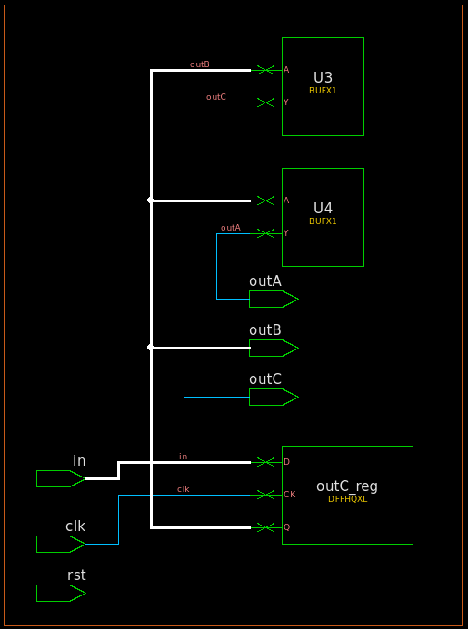

## Blocking Assignments in seq always block

```verilog
module SEQ_BLK (
    input clk,
    input rst,
    input  in,
    output reg outA, outB, outC
);
    // what happens if we use blocking assignments inside a sequential block?
    always @(posedge clk) begin
        outA = in;
        outB = outA;
        outC = outB;
    end

endmodule
```

* Synthesis result

