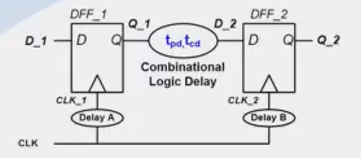
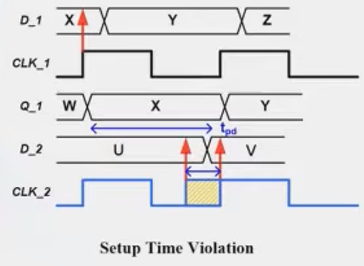

# Static Timing Analysis (STA)

## Terminologies

* $T_{cd}$ (Contamination delay)

  * For an combinational circuit, the **minimum time** it takes for an input change to cause an output change.
  * It determines how soon the output sees an output transition (not stable yet).
  * If $T_{cd}$ is too small, it can cause hold-time violations: $T_{cd}$ is too small, making $D_2$ capture errornous value ($U$ does not hold long enough).
  
    

* $T_{pd}$ (Propagation delay)

  * The **maximum time** it takes for an input change to be fully reflected (stable) at the output.
  * Also called **maximum delay** or **critical path delay**.
  * If $T_{pd}$ is too large, it can cause setup-time violations: $T_{pd}$ is too large, making $D_2$ capture errornous value ($V$ comes too late).
  
    

* Note that the **minimun/maximun** terms are referring to the longest and shortest possible $T_{cd}$ and $T_{pd}$ **through the entire circuit**, because the timing of any two regs and the comb logics b/w them are analyzed
