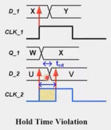

# Static Timing Analysis (STA)

### $T_{cd}$ (Contamination delay)

  * For an combinational circuit, the **minimum time** it takes for an input change to cause an output change.
  * It determines how soon the output sees an output transition (not stable yet).
  * If $T_{cd}$ is too small, it can cause hold-time violations: $T_{cd}$ is too small, making $D_2$ capture errornous value ($U$ does not hold long enough).
  
    

### $T_{pd}$ (Propagation delay)

  * The **maximum time** it takes for an input change to be fully reflected (**stable**) at the output.
  * Also called **maximum delay** or **critical path delay**.
  * If $T_{pd}$ is too large, it can cause setup-time violations: $T_{pd}$ is too large, making $D_2$ capture errornous value ($V$ comes too late).
  
    

#### Note that the **minimun/maximun** terms are referring to the longest and shortest possible $T_{cd}$ and $T_{pd}$ **through the entire circuit**, because the timing of any two regs and the comb logics b/w them are analyzed

### $t_{ccq}$ (<ins>C</ins>ontamination <ins>C</ins>lk-to-<ins>Q</ins> delay)

* The minimum amount of time from an clock edge until Q starts to change its value

### $t_{pcq}$ (<ins>P</ins>ropagation <ins>C</ins>lk-to-<ins>Q</ins> delay)
* The maximum amount of time from an clock edge until Q reaches **steady** state

## Setup-Time Criterion

* ### Criterion: $Data\ Arrive\ Time < Data\ Required\ Time$
  * Make sure the data launched from DFF_1 is correctly captured by DFF_2 at **NEXT CLOCK** (that's why taking $T_{cycle}$ into consideration)
  * Make sure the data is being stable early enough, such that the capture register can read the data correctly
  * $Data\ Arrive\ Time = t_{pcq} + t_{pd}$

  * $Data\ Required\ Time = T_{cycle} + t_{skew} - t_{setup}$
    * $t_{skew} = T_{capture} - T_{launch}$
      * $T_{launch}$: The clock offset b/w the main clock (CLKM) & the launch register (UFF0)
      * $T_{capture}$: The clock offset b/w CLKM & UFF1
    * $t_{setup}$: The required time for the register to read the data correctly, which is defined by the adopted cell-library (vendor)
  * $Slack = Data\ Required\ Time - Data\ Arrive\ Time$

## Hold-Time Criterion

* Clock (net) delay or Clock skew ($T_{capture} - T_{launch}$) >>> combinational delay ($t_{cd}$)

<!--  -->
* Passed Hold-time Check 
  * If $t_{ccq} + t_{cd}$ is too small, DFF_2 will capture 1, not 0, i.e., the previous data (0) is overwritten by 1.
  
  

* ### Criterion: $Data\ Arrive\ Time > Data\ Required\ Time$
  * Check that the data launched from the first flip-flop does not reach the second flip-flop too soon (i.e., it should not overwrite the previous data before the hold time is satisfied)
